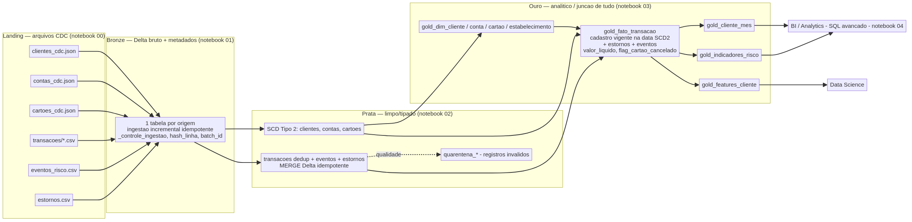

# Data Transacional — Cooperativa NovaRota

Lakehouse em arquitetura **Medallion** (Bronze → Prata → Ouro) sobre **Delta
Lake**, construído para análise de comportamento transacional, prevenção de
perdas e consumo por Data Science. Implementado em **PySpark + Delta Lake** (o
mesmo motor do Databricks), com ingestão incremental, qualidade de dados,
histórico de dimensões (SCD Tipo 2), SQL avançado, testes e documentação das
decisões técnicas.


## Sumário

- [Arquitetura](#arquitetura)
- [Modelo de dados](#modelo-de-dados)
- [Estrutura do projeto](#estrutura-do-projeto)
- [Setup](#setup)
- [Execução ponta a ponta](#execução-ponta-a-ponta)
- [Consultas SQL](#consultas-sql-avançadas)
- [Testes e lint](#testes-e-lint)
- [Modelo de dados (Ouro)](#modelo-de-dados-ouro)
- [Idempotência e reprocessamento](#idempotência-e-reprocessamento)
- [Evidências de execução](#evidências-de-execução)
- [Premissas e limitações](#premissas-e-limitações)
- [Próximos passos](#próximos-passos)

## Arquitetura


## Modelo de dados

## Stack

| Camada | Tecnologia                   |
|---|------------------------------|
| Processamento | Apache Spark 3.5 (PySpark)   |
| Formato / ACID | Delta Lake 3.2               |
| Linguagem | Python 3.10 ou superior      |
| Configuração | YAML + variáveis de ambiente |
| Testes / Lint | pytest, ruff                 |
| CI | GitHub Actions               |

## Estrutura do projeto

```
desafio-engenharia-dados2/
├── config/config.yaml            # parametrização (catálogo, schemas, paths, modo)
├── docs/                         # arquitetura + decisões técnicas + diagramas
├── evidencias/                   # logs/saídas reais de execução
├── notebooks/                    # camada de execução/demonstração (Databricks)
├── sql/
│   ├── ddl/                      # criação de schemas
│   └── analytics/                # SQL avançado (CTEs, window functions, MERGE)
├── src/novarota/
│   ├── config.py                 # configuração parametrizável
│   ├── common/                   # spark, logging, metadados
│   ├── ingestao/                 # gerador de massa + camada Bronze
│   ├── qualidade/                # regras de qualidade + quarentena
│   ├── transformacao/            # SCD2, camada Prata, camada Ouro
│   └── jobs/                     # entrypoints (bronze/prata/ouro/pipeline/analytics)
├── tests/                        # testes unitários e de transformação
├── requirements.txt / pyproject.toml
└── .github/workflows/ci.yml      # lint + testes
```

## Pré-requisitos

- Python 3.10 ou superior

## Setup

```bash
# 1. Criar e ativar o ambiente virtual
python3 -m venv .venv
source .venv/bin/activate            # Windows: .venv\Scripts\activate

# 2. Instalar dependências e o pacote (modo editável)
pip install -r requirements.txt
pip install -e .
```
## Execução ponta a ponta

Forma mais simples — pipeline completo com geração da massa sintética:

```bash
python -m novarota.jobs.pipeline --gerar-dados --modo full
```

Ou camada por camada (útil para depurar / agendar separadamente):

```bash
python -m novarota.jobs.gerar_dados_job          # gera a massa em data/landing
python -m novarota.jobs.bronze_job --modo full   # ingestão Bronze (Delta)
python -m novarota.jobs.prata_job                # limpeza, qualidade, SCD2
python -m novarota.jobs.ouro_job                 # fato, dimensões, features
```

Parâmetros disponíveis em todos os jobs (sobrescrevem `config/config.yaml`):

| Parâmetro | Descrição |
|---|---|
| `--config` | Caminho de um YAML alternativo |
| `--modo` | `full` ou `incremental` |
| `--data-referencia` | Data de referência (`YYYY-MM-DD`) |
| `--batch-id` | Identificador do batch |

Parametrização por ambiente,exemplo:

```bash
export NOVAROTA_MODO_EXECUCAO=incremental
export NOVAROTA_SCHEMA_OURO=ouro
```

## Consultas SQL avançadas

```bash
python -m novarota.jobs.analytics_job
```

Executa e exibe o resultado de todas as consultas em
[`sql/analytics/`](sql/analytics), cobrindo os requisitos obrigatórios:

| Arquivo | Técnica |
|---|---|
| `01_registro_vigente_row_number.sql` | `ROW_NUMBER` (registro vigente/dedup) |
| `02_comparativo_mensal_lag_lead.sql` | `LAG` / `LEAD` (comparação entre períodos) |
| `03_primeiro_ultimo_comportamento.sql` | `FIRST_VALUE` / `LAST_VALUE` |
| `04_segmentacao_ntile_percentrank.sql` | `NTILE` / `PERCENT_RANK` |
| `05_anomalias_transacionais.sql` | Detecção de anomalias (z-score) |
| `06_cliente_vs_historico_e_cidade_segmento.sql` | Cliente vs próprio histórico **e** vs cidade/segmento |
| `07_merge_incremental.sql` | `MERGE INTO` incremental idempotente |

Todas usam **CTEs encadeadas**. Há também `MERGE` em PySpark/Delta na
historização SCD2 (`src/novarota/transformacao/scd2.py`).

## Executando no Databricks

A lógica é PySpark + Delta puro, então roda no Databricks **sem alterar o
código**. Funciona em cluster clássico **e em Serverless** — usamos o `spark`
nativo do notebook (no Serverless não há acesso a `sparkContext`) e o Unity
Catalog com Volumes. Serve em workspace corporativo, trial ou **Free Edition**.

1. **Compute**: **Serverless** ou um cluster **DBR 15.x LTS** (Spark 3.5 + Delta
   nativos). Não é preciso instalar Spark/Delta.
2. **Código**: Workspace → **Repos** → *Add Repo* → cole a URL deste
   repositório.
3. **Executar**: rode os notebooks **na ordem**, um por camada — cada um localiza
   o pacote sozinho (sem `%pip`) e, no Databricks, prepara o Unity Catalog:
   `00_setup_e_massa` → `01_bronze` → `02_prata` → `03_ouro` → `04_analytics_sql`.

> **Guia completo** (local, Databricks Serverless e CI/CD):
> [`docs/como-rodar.md`](docs/como-rodar.md).

   **Detalhes de compatibilidade com Serverless/UC:**
   - As tabelas são **gerenciadas pelo Unity Catalog** (`saveAsTable`). Não use
     *external location*; o único Volume necessário é o `landing`, apenas para
     os arquivos de entrada.
   - No Databricks o notebook liga `config.usar_catalogo = True`, então as
     tabelas ficam totalmente qualificadas (`novarota.bronze.clientes`, …);
     localmente o padrão é `False` (`schema.tabela`, pois o metastore local não
     tem catálogo de 3 níveis).
   - O `arquivo_origem` da Bronze usa `_metadata.file_path` (e não
     `input_file_name()`, que não é suportado no Spark Connect/Serverless).
4. **Validar / evidências** — os prints destas células comprovam a execução:
   ```sql
   SELECT count(*) FROM novarota.ouro.gold_fato_transacao;                 
   SELECT id_cliente, count(*) FROM novarota.prata.clientes GROUP BY 1;    
   SELECT id_transacao, valor, valor_liquido, flag_cartao_cancelado
   FROM   novarota.ouro.gold_fato_transacao ORDER BY id_transacao;       
   ```

## Testes e lint

```bash
pytest -q                                  
ruff check src tests conftest.py           
```

Os testes cobrem regras de qualidade/quarentena, metadados/hash, construção do
SCD2 (vigências, delete, dedup, surrogate key) e agregações da camada Ouro.

## CI/CD (GitHub Actions)

Dois workflows:

- **`.github/workflows/ci.yml`** — roda em todo push/PR: `lint` (ruff) →
  `testes` (pytest + Spark) → `validar-bundle` (YAML do Asset Bundle/workflows).
- **`.github/workflows/databricks.yml`** — a **cada push na `main`** (ou disparo
  manual) publica o **Databricks Asset Bundle** (`databricks.yml`) e **executa o
  Job** do pipeline Medallion no Databricks (Serverless), com uma task por camada
  encadeada: `setup → bronze → prata → ouro → analytics`.

Para o workflow do Databricks funcionar, cadastre em **Settings → Secrets and
variables → Actions** do repositório:

| Secret | Descrição |
|---|---|
| `DATABRICKS_HOST` | URL do workspace (ex.: `https://dbc-xxxx.cloud.databricks.com`) |
| `DATABRICKS_TOKEN` | Personal Access Token do workspace (User Settings → Developer → Access tokens) |

O Job é definido roda em **compute Serverless**. 
Cada notebook importa o pacote `novarota` via `sys.path` a
partir de `${workspace.file_path}/src` (parâmetro `bundle_root`), sem `%pip`.
Rodar localmente (opcional): `databricks bundle deploy -t prod && databricks
bundle run novarota_pipeline_medallion -t prod`.

## Modelo de dados (Ouro)

| Tabela | Grão | Chave |
|---|---|---|
| `gold_fato_transacao` | 1 linha por transação válida | `id_transacao` |
| `gold_dim_cliente` / `gold_dim_conta` / `gold_dim_cartao` | 1 linha por entidade vigente | `id_*` |
| `gold_dim_estabelecimento` | estabelecimento + mcc | `id_estabelecimento` |
| `gold_cliente_mes` | cliente × ano_mes | (`id_cliente`, `ano_mes`) |
| `gold_indicadores_risco` | cliente × ano_mes | (`id_cliente`, `ano_mes`) |
| `gold_features_cliente` | 1 linha por cliente | `id_cliente` |


## Idempotência e reprocessamento

- **Bronze**: tabela de controle de arquivos processados → reexecutar não
  duplica dados.
- **Prata**: `MERGE` por *surrogate key* determinística → histórico
  reconstruído de forma estável; **dados atrasados** apenas reordenam vigências.
- **Ouro**: recomputados a partir das camadas anteriores;
  `MERGE`/overwrite garantem estado consistente a cada run.


## Evidências de execução

Logs e amostras reais em [`evidencias/`](evidencias/README.md): execução do
pipeline, resultado das consultas SQL, amostras das tabelas e saída de
testes/lint.

## Premissas e limitações

- **Massa** gerada por código (`src/novarota/ingestao/gerador_dados.py`),
  simulando os problemas de qualidade pedidos (duplicidade, CDC, dados atrasados,
  evolução de schema, integridade quebrada). Nenhum dado real, credencial ou
  token é utilizado.
- Adicionamos o campo `valor_estorno` em `estornos` para distinguir estorno
  parcial de total.
- Metastore local no lugar do Unity Catalog; catálogo de três níveis
  fica implícito.
- A ingestão incremental usa tabela de controle no lugar do Auto Loader.

